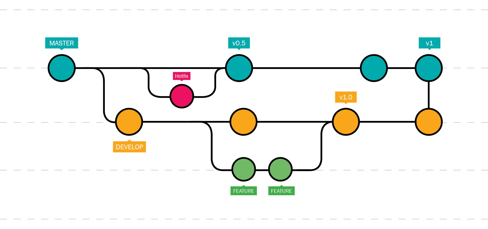

# Contributing

## Code conventions

We try to follow [Rust API Guidelines](https://rust-lang.github.io/api-guidelines/about.html) and the [Rust Style Guide](https://doc.rust-lang.org/beta/style-guide/index.html).

## Git usage

We use the [Conventional Commits 1.0.0](https://www.conventionalcommits.org/en/v1.0.0/) specification to format our commits.

As for our workflow, we use the following with the following branch names :
- hotfix : `hotfix-<hotfix name>`
- feature : `feat-<feature name>`
- develop : `dev-v<version number>`

## Versioning

We use the [Semantic Versioning](https://semver.org/).
